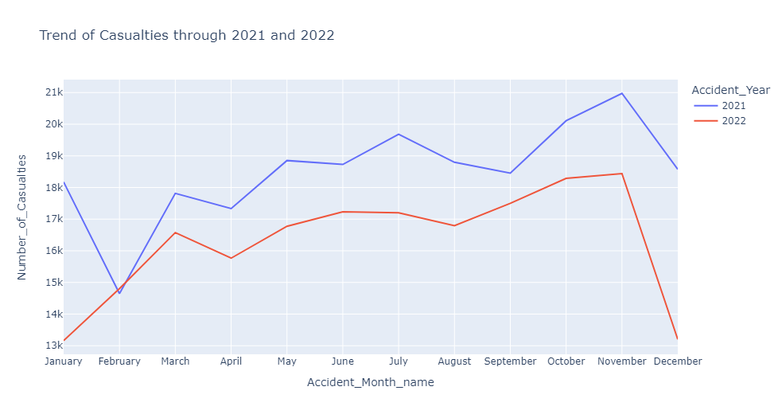
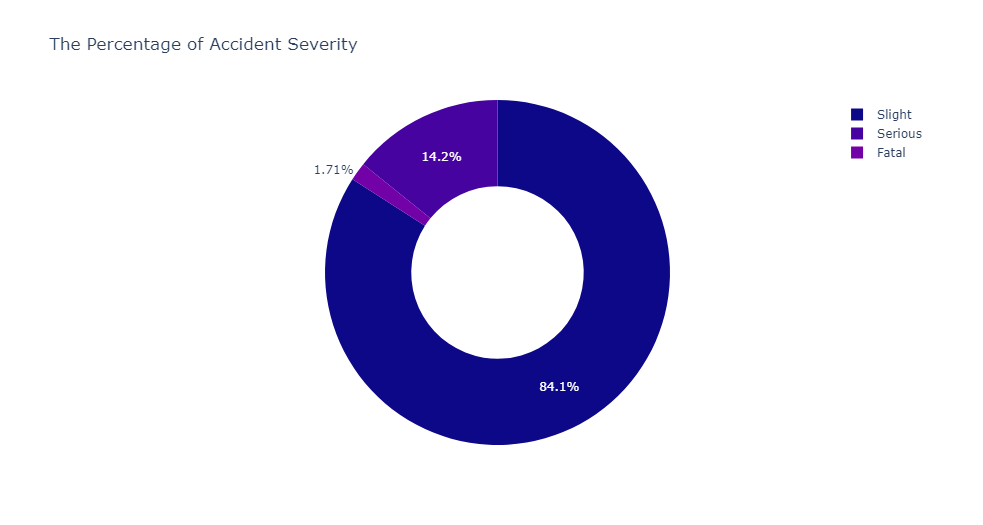
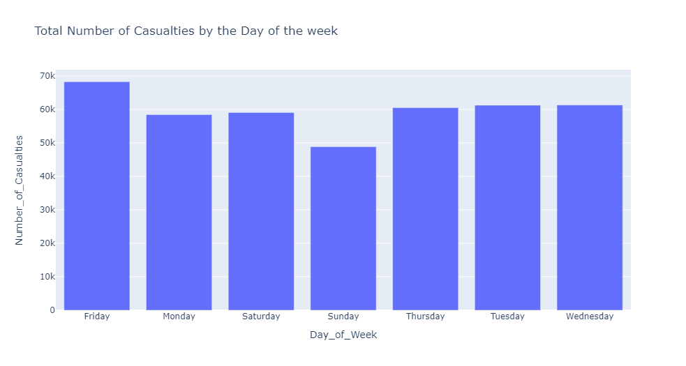
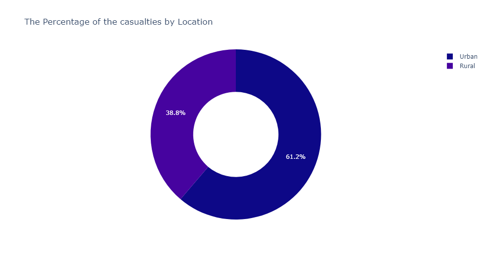
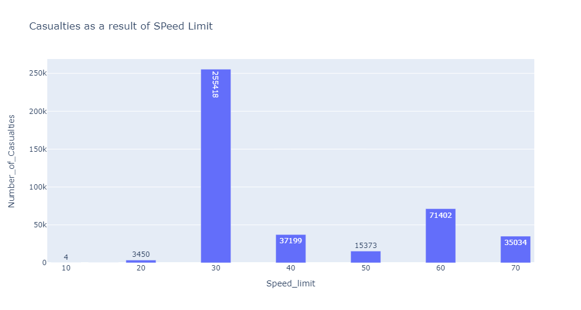
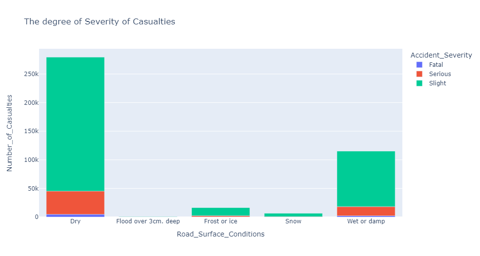

# Road-Accident-Analysis

## Introduction 
This is a project that makes use of Python Programming Language to analyze Road Accidents and Casualties. 
The project is to analyze and answer crucial question and help the government and the respective authorities to make data driven decisions.

## Problem Statement
1.	What is the trend of the casualties Year on Year (YoY)?
2.	Based on the degree of Severity, what’s the percentage of each class of Severity?
3.	On which days of the week do was the  highest number of Casualties recorded?
4.	Which Locations do Accidents Occur the most?
5.	Based on Speed Limit, how much Casualties are recorded?
6.	Other features and Visuals that can help also.

## Skills and Concept Demonstrated
1.	Python
2.	Pandas
3.	Plotly.Express
4.	Matplotlib
5.	Seaborn
	
## Feature Engineering
This involves deriving new values from the existing values and columns of the datasets. This helps to enhance the datasets and also to be able provide better solutions to pressing problems.
I had to derive new columns from the existing columns such as isolating the Year column and converting the month number to their respective month names in different columns.
This affords for easy interpretation, understanding and Presentation the data insights to stakeholders. 

## Visualization
Each Problem Statement have been answered through using different Visualization methods that can be interpreted and understood even by the layman. The data comes alive through these Visuals

1.	What is the trend of the casualties Year on Year (YoY)?

2.	Based on the degree of Severity, what’s the percentage of each class of Severity?

3.	On which days of the week do was the  highest number of Casualties recorded?

4.	Which Locations do Accidents Occur the most?

5.	Based on Speed Limit, how many Casualties are recorded?

6.	Based on Road Surface Conditions, how many Casualties are recorded

## Conclusions 
This was a project that was worth every of my time as it stretched my problem solving skill and also helped me master certain functions of the Programming Language.

### PS: For more information, you can check through my code file itself. It's the IPYNB File.
However, to get to view the codes with the charts and visuals, you have to take the following steps:
1. Open this link 'http://nbviewer.jupyter.org/
2. paste this link within the link above 'https://github.com/EnochBabs/Road-Accident-Analysis/blob/main/Road%20Accident%20Analysis%20Code.ipynb'

Thnak you!

